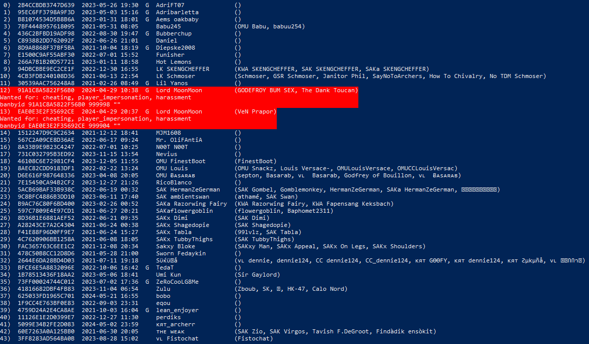

# chiv-admin-helper
Helps chiv admins by validating player lists in your clipboard.

## What it does
When you run `listplayers` in the chiv console this tool will automatically grab your clipboard contents
and scans the list of players.
This will give you a table of every connected player with their PlayFab ID, account creation date, platform, current name and known aliases.

Wanted and suspicious players are highlighted alongside pre-written ban or kick commands that you can use to quickly take action:

Ban commands are generated by the **SAK Wanted Board**. 
The wanted board is a global and shared ban list that contains known hackers, FFAers, racists or otherwise banned players.
If you want a player on that list open a ticket on the SAK discord server.
This way bans are applied to every server where admins use this tool.
When a ban is not permanent they will expire at the same time across every server.

The suspicion level of a player is calculated using a variety of metrics.
Suspicious players will be marked yellow and show both a kick and ban command.
This filter is fine-tuned by SAK to warn against potential server crashers to allow banning them before they spawn and crash the server.
False positives like innocent noobs or alt accounts are possible.

## How it works
As mentioned above this tool continuously monitors your clipboard data.

***IMPORTANT:*** **It only reads text data (not files or images) and only responds when the clipboard contains a `listplayers` output.**

While windows defender does not classify this as a threat be aware that this might trigger other virus scanners,
since this could technically be used to steal passwords!
You are welcome to check the source code yourself and build this project on your own to verify that no such activity is happening.

## Setup
If you want to use this tool you need to receive credentials since the wanted board and any other resources are not publicly accessible.
To get access open a ticket on the SAK discord server.

Run this tool via powershell, cmd or shortcut.
Credentials can be provided as a command line argument or dynamically input into the tool after startup.

